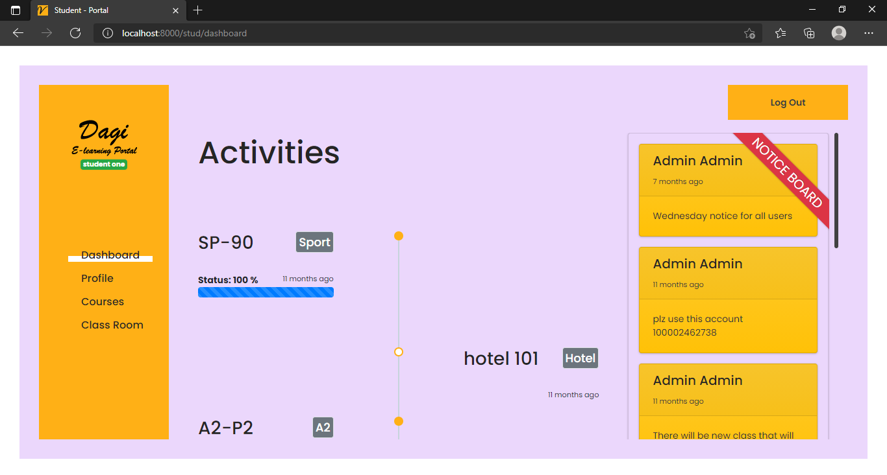
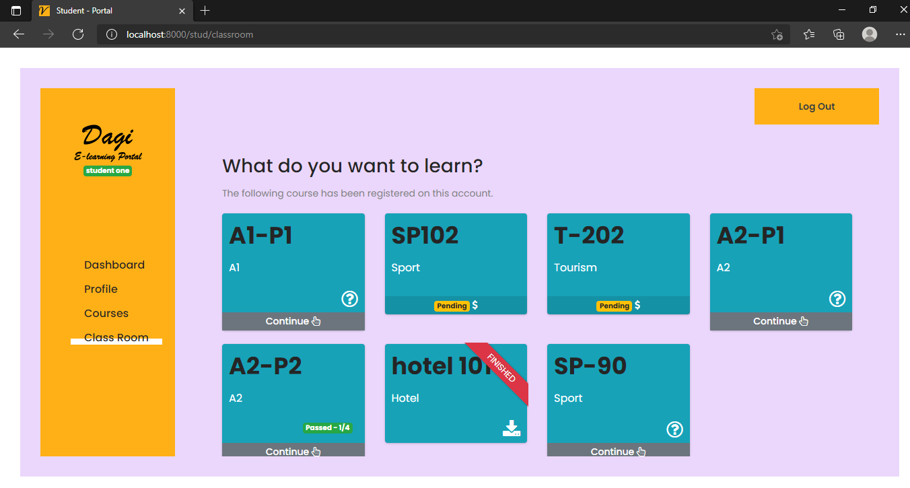
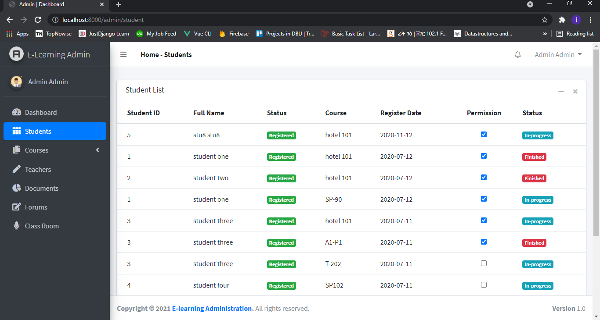
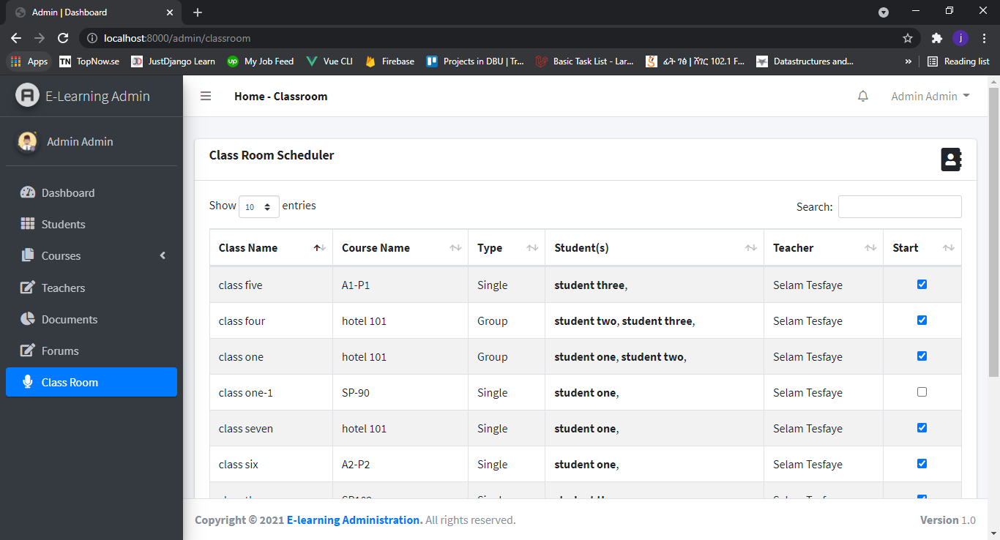

## E-Learning Portal

E-learning, also referred to as online learning or electronic learning, is the acquisition of knowledge which takes place through electronic technologies and media. In simple language, e-learning is defined as “learning that is enabled electronically”. Typically, e-learning is conducted on the Internet, where students can access their learning materials online at any place and time. E-Learning most often takes place in the form of online courses, online degrees, or online programs.
### Features

- **Administration**
    - **Dashboard**
        - **Students**
        - **Programs**
        - **Statistics**
        - **Notification**
    - **Dynamic Course and Content Generation**
    - **Student Registration List**
    - **Forums**
    - **Manage**
        - **Each Virtual Classroom**
        - **Each Forum**
        - **Each Teacher**
        - **Each Student**
- **Student**
    - **Registration**
    - **Login**
    - **Dashboard**
    - **Courses Progress**
    - **Cousres Lists**
    - **Profile**
    - **Forum**
    - **Virtual Classroom**
    - **Notification Center**
    

## Contributing

Thank you for considering contributing to the E-learning portal!

## Security Vulnerabilities

If you discover a security vulnerability within Laravel, please send an e-mail to Amanuel Tesfaye via [amanueltsfy@gmail.com](mailto:amanueltsfy@gmail.com). All security vulnerabilities will be promptly addressed.

## License

The Laravel framework is open-sourced software licensed under the [MIT license](https://opensource.org/licenses/MIT).
